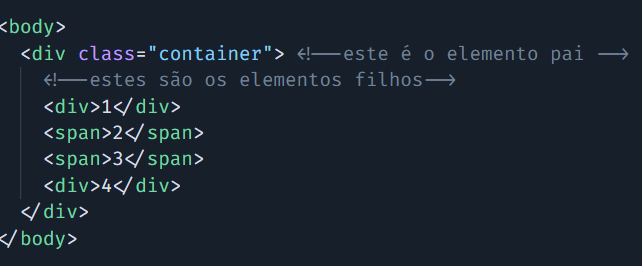
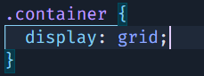
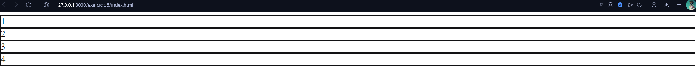
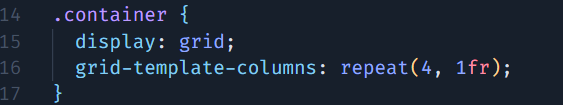
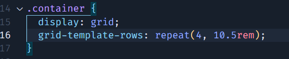
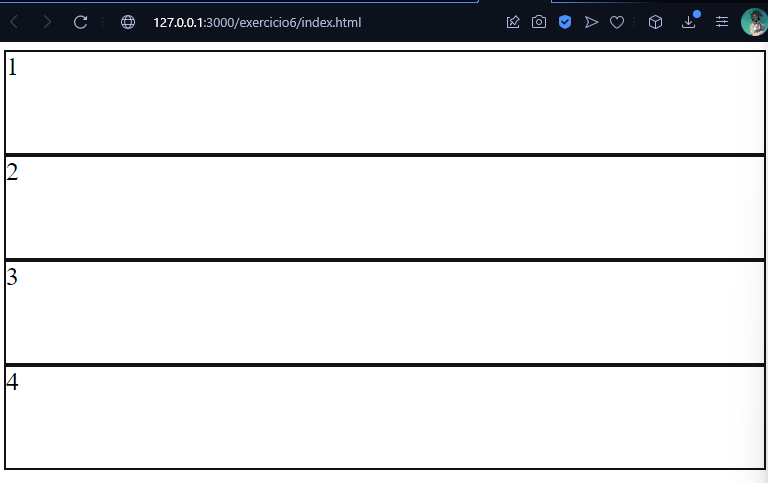

# Layout GRID

Imaginemos o GRID como um guarda-roupas para o design web, um espaço organizado e estruturado que proporciona uma disposição sistemática de elementos visuais na tela. Assim como no guarda-roupas, onde cada prateleira e gaveta tem uma função específica para armazenar roupas, o GRID nos permite alocar elementos em locais distintos da tela.

Em termos de design, esse GRID é composto por colunas e linhas, formando uma grade que divide a tela em seções. Cada interseção entre colunas e linhas é um ponto preciso onde podemos posicionar elementos, como textos, imagens ou botões. Essa estrutura oferece uma abordagem organizada para o layout, facilitando o alinhamento e a distribuição uniforme dos componentes.

Assim como você decide onde colocar camisetas, calças e sapatos em diferentes prateleiras do guarda-roupas, no GRID, você decide deliberadamente onde posicionar elementos na tela, otimizando a disposição visual do seu site ou aplicativo. A flexibilidade do GRID permite uma adaptação eficiente a diferentes tamanhos de tela, garantindo uma experiência consistente para os usuários, assim como um guarda-roupas bem organizado proporciona facilidade no acesso às roupas de acordo com a necessidade.

**obs: O grid pode ter a quantidade que colunas e linhas que você deseja colocar e de acordo com o que melhor se adapta com seu layout.**

## PROPRIEDADES FUNDAMENTAIS:

Todo grid é composto de 2 principais grupos:
**container: o pai** e **itens: o(s) filhos**

para adicionar o display: **grid** você deve pegar o elemento **pai** e coloca-lo como:

assim todos os elementos filhos mesmo tendo o comportamento inlime(**um ao lado do outro(span)**) ficaram com o comportamento no formato block(**um abaixo do outro**).

**obs:** O grid sempre vai cria as linhas primeiros, a quantidade de linhas vai depender da quantidade de filhos que esteve dentro do elemento pai.

---

### Propriedades CONTAINER (Pai):

- diplay: grid;
- grid-template; -> é um shorthand que pode atribuir outras 3 propriedades ao mesmo tempo: 
  - grid-template-colums 
  - grid-template-rows  
  - grid-template-areas;

### grid-template-colums;
O grid-template-colums eu informo a quantidade de columas que meu layout grid vai ter, tambem informando a largura de cada columa, utilizando as medidas em: px, rem, vw ou fr.

Em um exemplo que eu tenha que ter 3 colums do mesmo tamanho, eu posso ultilizar uma propriedade chamada **repeat()**:
ex: 
 

**No exemplo acima estou informando que o grid irá ter 4 columas com 1fr de largura carda.**

Este é o resultado no seu HTML:

### grid-template-rows:
O grid, se você não informar a quantidade e altura das linhas, ele define para você automaticamente, dependendo da quantidade de elementos que você tiver no elemento pai. Mas você pode definir manualmente a quantidade de linhas e suas alturas utilizando o **grid-template-rows**

**Neste exemplo esta colocando nas 4 linhas uma largura de 10.5rem;**

